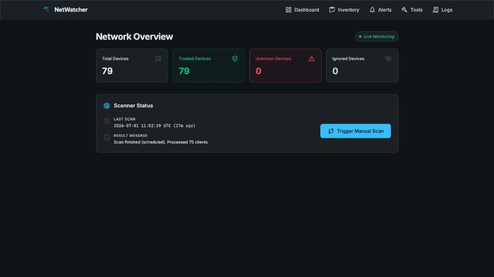

<p align="center">
  
</p>

# NetWatcher for UniFi

> A lightweight UniFi unknown-device monitor with WebUI, SQLite history, approval workflow, and pluggable alerts.

I've wanted a lightweight monitor to routinely scan my home network for unknown devices. Normally [WatchYourLAN](https://github.com/aceberg/WatchYourLAN) and [NetAlertX](https://netalertx.com/) are the most popular options, but these are a bit heavy for my needs, and Ubiquiti offers a table via its administrative interface that can be scanned. I found [NetWatcher](https://github.com/coolcat1575/netwatcher/) but this was unmaintained and I wanted a solution I could plug into Docker or Proxmox easily to perform the same thing.

This project monitors your network for unknown MAC addresses using data from a UniFi Controller / UniFi Network Server and provides configurable alerts (Pushover, Webhooks, etc.). It acts as a lightweight, single-container alternative to heavy monitoring stacks.

## Features

- **Web Dashboard**: View unknown, trusted, and ignored devices.
- **Approval Workflow**: Click to trust or ignore devices directly from the UI.
- **Pluggable Notifications**: Native support for Pushover and Generic Webhooks.
- **Alert Deduplication**: Built-in cooldown prevents alert spam for the same device.
- **UniFi API Integration**: Fetches client statistics directly from the UniFi Controller.
- **Blocking**: Optional native UniFi blocking logic (supports Dry Run testing).
- **Import/Export**: Easy ingestion of legacy `trusted.txt` files and CSV exports.

## Quick start

```bash
git clone https://github.com/andrewtryder/unifi-netwatcher.git
cd unifi-netwatcher
cp .env.example .env
```

Edit `.env` before starting the container. At minimum, set:

- `UNIFI_URL`
- `UNIFI_USERNAME`
- `UNIFI_PASSWORD`
- `UNIFI_SITE`
- `UNIFI_VERIFY_SSL`
- `UNIFI_MOCK_MODE=false`

Then start NetWatcher:

```bash
docker compose up -d
```

Open **http://localhost:8080** (or your host's IP on port 8080).

Images are published to [GHCR](https://github.com/andrewtryder/unifi-netwatcher/pkgs/container/unifi-netwatcher) and [Docker Hub](https://hub.docker.com/r/andrewtryder/unifi-netwatcher) on each release. `compose.yml` pulls from GHCR by default; pin a version by changing the image tag (e.g. `ghcr.io/andrewtryder/unifi-netwatcher:0.1.0`).

### Updates

```bash
docker compose pull
docker compose up -d
```

## Local development

### Native Python / Node

```bash
python3 -m venv .venv
source .venv/bin/activate
pip install -r requirements.txt

npm install
npm run build:css

cp .env.example .env
uvicorn app.main:app --reload --port 8080
```

For local development without a UniFi controller, set `UNIFI_MOCK_MODE=true` in `.env`.

### Docker-based development

Builds from source and enables mock mode via `compose.dev.yml`:

```bash
cp .env.example .env
docker compose -f compose.yml -f compose.dev.yml up --build
```

## Configuration

Copy `.env.example` to `.env` and adjust as needed. Notification channels (Pushover, webhooks, etc.) are configured in the Web UI, not via environment variables.

| Variable | Description |
|---|---|
| `DATABASE_URL` | SQLite database path. Default `sqlite:///./data/netwatcher.db` works for both local dev and Docker (data is mounted at `./data`). |
| `UNIFI_URL` | Base URL of your UniFi Network application (no trailing slash). |
| `UNIFI_USERNAME` | UniFi account username. A dedicated account with only the permissions needed is recommended. |
| `UNIFI_PASSWORD` | UniFi account password. |
| `UNIFI_SITE` | UniFi site name (usually `default`). |
| `UNIFI_VERIFY_SSL` | Verify the controller TLS certificate (`true`/`false`). Set `false` only on trusted LANs with self-signed certs. |
| `UNIFI_TIMEOUT_SECONDS` | HTTP timeout when calling the UniFi API. |
| `SCAN_INTERVAL_SECONDS` | How often to poll the controller for clients (seconds). Default: `300`. |
| `ALERT_COOLDOWN_SECONDS` | Minimum time between repeat alerts for the same device (seconds). Default: `21600`. |
| `UNIFI_DRY_RUN_BLOCKS` | When `true`, log block actions without sending them to the controller. |
| `UNIFI_MOCK_MODE` | When `true`, use fixture data instead of a real controller. For demo/development only. |

## Releases

Versioning is automated with [Release Please](https://github.com/googleapis/release-please) using [Conventional Commits](https://www.conventionalcommits.org/). Merge the Release PR on `main` to cut a release and publish images to both registries.

| Prefix | Version bump |
|---|---|
| `fix:` | Patch |
| `feat:` | Minor |
| `feat!:` or `BREAKING CHANGE:` | Major |

## Security notes

- **UI authentication is not implemented yet.** Do not expose the container directly to the public internet without a reverse proxy that provides authentication.
- **Use a dedicated UniFi account** with only the permissions NetWatcher needs.
- **`UNIFI_VERIFY_SSL=false`** should only be used on trusted LANs.
- **Protect the data directory.** Notification secrets and UniFi configuration may be stored in local files and SQLite under `./data`.

## Screenshot

<p align="center">
  
</p>
