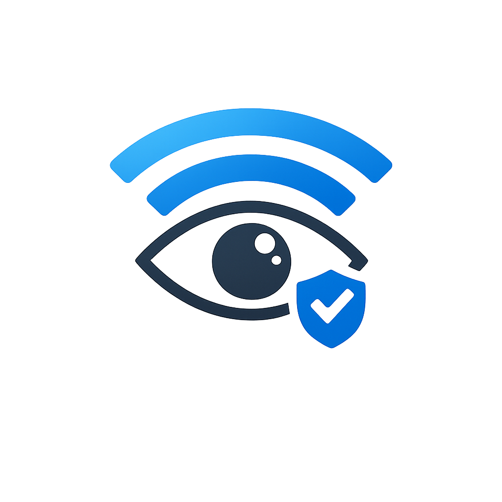
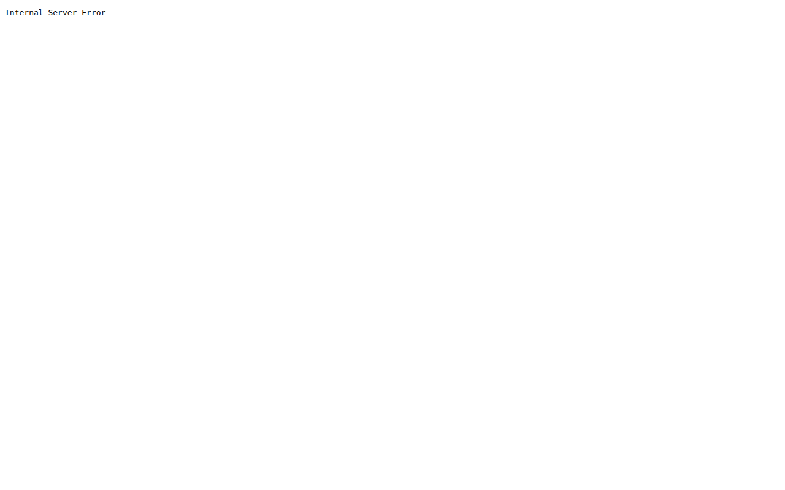

<p align="center">
  
</p>

# NetWatcher for UniFi

> A lightweight UniFi unknown-device monitor with WebUI, SQLite history, approval workflow, and pluggable alerts.

I've wanted a lightweight monitor to routinely scan my home network for unknown devices. Normally
WatchYourLan[https://github.com/aceberg/WatchYourLAN] and NetAlert X[https://netalertx.com/] are the most popular options, but these are 
a bit heavy for my needs, and Ubiquiti offers a table via its administrative interface that can be scanned. I found
Netwatcher[https://github.com/coolcat1575/netwatcher/] but this was unmaintained and I wanted a solution I could plug-into Docker or Proxmox easily to perform the same thing.

This project monitors your network for unknown MAC addresses using data from a UniFi Controller / UniFi Network Server and provides configurable alerts (Pushover, Webhooks, etc.). It acts as a lightweight, single-container alternative to heavy monitoring stacks.

## Features

- **Web Dashboard**: View unknown, trusted, and ignored devices.
- **Approval Workflow**: Click to trust or ignore devices directly from the UI.
- **Pluggable Notifications**: Native support for Pushover and Generic Webhooks.
- **Alert Deduplication**: Built-in cooldown prevents alert spam for the same device.
- **UniFi API Integration**: Fetches client statistics directly from the UniFi Controller.
- **Blocking**: Optional native UniFi blocking logic (supports Dry Run testing).
- **Import/Export**: Easy ingestion of legacy `trusted.txt` files and CSV exports.

## Quickstart (Development)

```bash
python3 -m venv venv
source venv/bin/activate
pip install -r requirements.txt
npm install && npm run build:css
cp .env.example .env
uvicorn app.main:app --reload --port 8080
```

## Docker Deployment

We recommend deploying via Docker Compose.

```yaml
services:
  unifi-netwatcher:
    image: ghcr.io/<owner>/unifi-netwatcher:latest
    container_name: unifi-netwatcher
    ports:
      - "8080:8080"
    environment:
      DATABASE_URL: "sqlite:////app/data/netwatcher.db"
      UNIFI_URL: "https://unifi.example.local"
      UNIFI_USERNAME: "admin"
      UNIFI_PASSWORD: "change-me"
      UNIFI_VERIFY_SSL: "false"
      UNIFI_DRY_RUN_BLOCKS: "true"
      # See .env.example for more options
    volumes:
      - ./data:/app/data
      - ./logs:/app/logs
    restart: unless-stopped
```

```bash
docker compose up -d
```

## Security Notes

1. **Credentials:** It is highly recommended to create a dedicated read-only Admin user in your UniFi controller specifically for NetWatcher.
2. **UI Authentication:** Local UI authentication is pending in a future release. **Do not expose this container directly to the public internet** without a reverse proxy providing authentication (e.g. Authelia, Authentik, or HTTP Basic Auth via NGINX/Traefik).
3. **TLS Warning:** If `UNIFI_VERIFY_SSL` is `false`, MITM attacks against the controller API are theoretically possible. Use it only on trusted LANs.

## Screenshots

### Dashboard


### Unknown Devices


### Inventory

