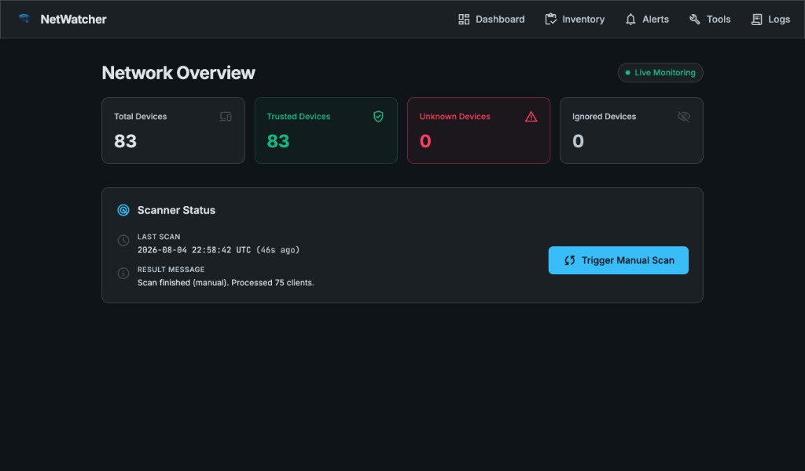

<p align="center">
  
</p>

<p align="center">
  
</p>

# NetWatcher for UniFi

> A lightweight UniFi unknown-device monitor with WebUI, SQLite history, approval workflow, and pluggable alerts.

I've wanted a lightweight monitor to routinely scan my home network for unknown devices. Normally [WatchYourLAN](https://github.com/aceberg/WatchYourLAN) and [NetAlertX](https://netalertx.com/) are the most popular options, but these are a bit heavy for my needs, and Ubiquiti offers a table via its administrative interface that can be scanned. I found [NetWatcher](https://github.com/coolcat1575/netwatcher/) but this was unmaintained and I wanted a solution I could plug into Docker or Proxmox easily to perform the same thing.

This project monitors your network for unknown MAC addresses using data from a UniFi Controller / UniFi Network Server and provides configurable alerts (Pushover, Webhooks, etc.). It acts as a lightweight, single-container alternative to heavy monitoring stacks.

## Features

- **Web Dashboard**: View unknown, trusted, and ignored devices.
- **Approval Workflow**: Click to trust or ignore devices directly from the UI.
- **Pluggable Notifications**: Native support for Pushover and Generic Webhooks.
- **Alert Deduplication**: Built-in cooldown prevents alert spam for the same device.
- **UniFi API Integration**: Fetches client statistics directly from the UniFi Controller.
- **Blocking**: Optional native UniFi blocking logic (supports Dry Run testing).
- **Import/Export**: Easy ingestion of legacy `trusted.txt` files and CSV exports.
- **Data Retention**: Configurable pruning of old observations and events (Tools UI or env).
- **Single-process scheduler**: Scans, OUI updates, and retention run inside the web process — deploy with one uvicorn worker and one replica (default Compose).

## Quick start

```bash
git clone https://github.com/andrewtryder/unifi-netwatcher.git
cd unifi-netwatcher
cp .env.example .env
```

Edit `.env` before starting the container. At minimum, set:

- `UNIFI_URL`
- `UNIFI_USERNAME`
- `UNIFI_PASSWORD`
- `UNIFI_SITE`
- `UNIFI_VERIFY_SSL`
- `UNIFI_MOCK_MODE=false`

Then start NetWatcher:

```bash
docker compose up -d
```

Open **http://localhost:8080** (or your host's IP on port 8080). Sign in with the bootstrap credentials **`admin` / `admin`**, then open **Security** and change the password immediately.

Images are published to [GHCR](https://github.com/andrewtryder/unifi-netwatcher/pkgs/container/unifi-netwatcher) and [Docker Hub](https://hub.docker.com/r/andrewtryder/unifi-netwatcher) on each release. `compose.yml` pulls from GHCR by default; pin a version by changing the image tag (e.g. `ghcr.io/andrewtryder/unifi-netwatcher:0.1.0`).

### Updates

```bash
docker compose pull
docker compose up -d
```

## Local development

### Native Python / Node

Requires [uv](https://docs.astral.sh/uv/), **Python 3.14+**, and Node 20+.

```bash
uv sync
npm ci && npm run build:css

cp .env.example .env
uv run uvicorn app.main:app --reload --port 8080
```

For local development without a UniFi controller, set `UNIFI_MOCK_MODE=true` in `.env`.

See [CONTRIBUTING.md](CONTRIBUTING.md) for PR title conventions, hooks, and release flow.
### Docker-based development

Builds from source and enables mock mode via `compose.dev.yml`:

```bash
cp .env.example .env
docker compose -f compose.yml -f compose.dev.yml up --build
```

## Configuration

Copy `.env.example` to `.env` and adjust as needed. Notification channels (Pushover, webhooks, etc.) are configured in the Web UI, not via environment variables. Background jobs (scans, OUI updates, retention) share a single APScheduler inside the web process — keep one uvicorn worker and one replica.

| Variable | Description |
|---|---|
| `APP_ENV` | `production` (default) or `development`. Development disables Jinja template bytecode caching for hot reload. |
| `DATABASE_URL` | SQLite database path. Default `sqlite:///./data/netwatcher.db` works for both local dev and Docker (data is mounted at `./data`). |
| `UNIFI_URL` | Base URL of your UniFi Network application (no trailing slash). |
| `UNIFI_USERNAME` | UniFi account username. A dedicated account with only the permissions needed is recommended. |
| `UNIFI_PASSWORD` | UniFi account password. |
| `UNIFI_SITE` | UniFi site name (usually `default`). |
| `UNIFI_VERIFY_SSL` | Verify the controller TLS certificate (`true`/`false`). Set `false` only on trusted LANs with self-signed certs. |
| `UNIFI_TIMEOUT_SECONDS` | HTTP timeout when calling the UniFi API. |
| `SCAN_INTERVAL_SECONDS` | How often to poll the controller for clients (seconds). Default: `300`. Overridable in **Tools**. |
| `ALERT_COOLDOWN_SECONDS` | Minimum time between repeat alerts for the same device (seconds). Default: `21600`. |
| `OBSERVATION_RETENTION_DAYS` | Delete observations older than this many days. Default: `30`. Use `0` to disable. Overridable in **Tools**. |
| `EVENT_RETENTION_DAYS` | Delete events (and related notification deliveries) older than this many days. Default: `90`. Use `0` to disable. Overridable in **Tools**. |
| `UNIFI_DRY_RUN_BLOCKS` | When `true`, log block actions without sending them to the controller. |
| `UNIFI_MOCK_MODE` | When `true`, use fixture data instead of a real controller. For demo/development only. |
| `SECURITY_RECOVERY_BYPASS` | Emergency only: when `true`, bypass CIDR filtering (does not disable auth or reset passwords). Default `false`. |

## Releases

Versioning is automated with [Release Please](https://github.com/googleapis/release-please) using [Conventional Commits](https://www.conventionalcommits.org/). Merge the Release PR on `main` to cut a release and publish images to both registries.

| Prefix | Version bump |
|---|---|
| `fix:` | Patch |
| `feat:` | Minor |
| `feat!:` or `BREAKING CHANGE:` | Major |

## Security notes

NetWatcher includes **application-level HTTP Basic authentication** (enabled by default) and optional **CIDR source-IP restrictions**. The container still listens on `0.0.0.0:8080` so LAN devices can reach it; access control is enforced inside the app, not by binding to loopback.

### Default credentials (bootstrap only)

- Username: `admin`
- Password: `admin`

These are **bootstrap credentials**, not a secure default. Change the password immediately after first startup via **Security** in the Web UI. A persistent banner reminds you while the defaults remain active. The password is stored only as an Argon2 hash in SQLite — never in plaintext or in source control.

### Authentication modes

- **Enabled (default):** every page and API (except `/healthz`, `/readyz`, and `/static/*`) requires valid Basic credentials.
- **Disabled:** general routes are open to any client that can reach port 8080. The **Security** page and its save endpoints always require administrator credentials so an anonymous visitor cannot change policy after auth is turned off. Disabling auth requires the current password and an explicit confirmation checkbox.
- Saving a username or password change may cause the browser to prompt for credentials again.

### CIDR restrictions

Configure under **Security → Network Restrictions**:

```text
192.168.1.0/24
10.0.0.25/32
fd00:1234::/64
```

- Uses the direct peer address (`request.client.host`). **`X-Forwarded-For` / `X-Real-IP` are not trusted.**
- Preview shows the effective client IP NetWatcher sees and whether that IP would remain allowed.
- CIDR filtering cannot be enabled with an empty allowlist.
- A save that would lock out your current IP is rejected unless you check the override and type exactly `ALLOW LOCKOUT`. After a lockout you may need host/Docker console access or the recovery flag below.

### Emergency recovery

```bash
SECURITY_RECOVERY_BYPASS=true
```

When set, CIDR filtering is bypassed only (authentication is unchanged; passwords are not reset). The app logs a prominent startup warning. Disable the flag after you regain access and fix the allowlist.

### Other guidance

- **Do not expose NetWatcher to the public internet** without understanding that auth is a single shared admin account (HTTP Basic) and that disabling auth grants full administrative access to every reachable client.
- **Use a dedicated UniFi account** with only the permissions NetWatcher needs.
- **`UNIFI_VERIFY_SSL=false`** should only be used on trusted LANs.
- **Protect the data directory.** Notification secrets, UniFi configuration, and the password hash live under `./data`.
